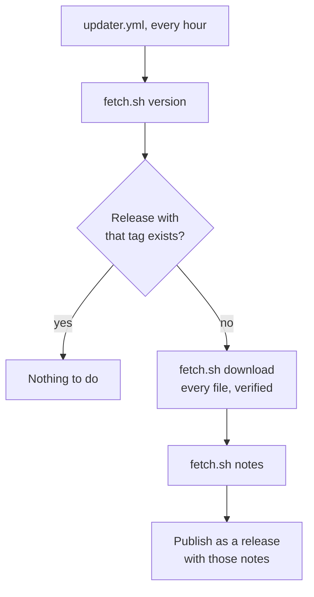

# Contributing

## How the mirror works

[`updater.yml`](./workflows/updater.yml) publishes each new upstream version as a release:

Everything specific to the upstream lives in [`scripts/fetch.sh`](../scripts/fetch.sh) and the READMEs. To mirror another project with this repository, rewrite the script's three commands, described at its top, and the three READMEs.
